#  BrowserRecon: The Private Digital Archive

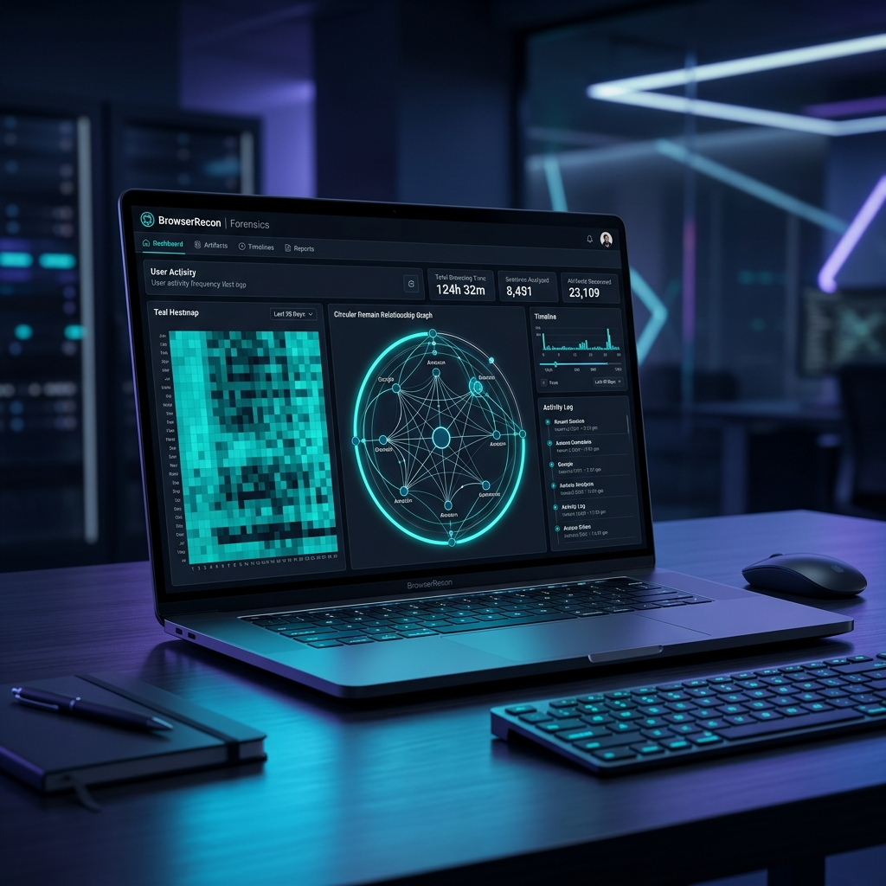

> [!CAUTION]
> ### ⚠ IMPORTANT — AUTHORIZED & LAB USE ONLY
> **BrowserRecon is a specialized forensic analysis utility intended exclusively for controlled laboratory environments and authorized digital forensic investigations (DFIR). Unauthorized access to data is a criminal offense. Always obtain written authorization before extracting data from any system you do not own.**
> [**Read the Full Forensic & Security Notice →**](FORENSIC_NOTICE.md)

---

## 🔎 The Hidden Vault: The Story of Your Digital Breadcrumbs

In the modern age, we live our lives through a browser tab. Every search query for a late-night symptom, every cookie that tracks our shopping habits, and every bookmark we save for a "someday" project forms a dense, invisible trail of digital breadcrumbs. But for most of us, this data is locked away in cryptic SQLite databases, hidden deep within system folders, and remains largely unreadable without technical expertise.

**BrowserRecon was born from a simple question: What if you could own your own data?**

Most people don't realize that their browser history is a goldmine of insights—not just for advertisers, but for you. It tells the story of your productivity, your interests, and even your digital safety. BrowserRecon is the "Digital Detective" that helps you unlock these stories, providing a professional-grade forensic interface that is simple enough for anyone to navigate, yet powerful enough for a SOC analyst performing triage.

---

## 👥 Who is BrowserRecon For?

Whether you are a professional investigator or a curious power user, BrowserRecon provides the tools you need to see through the noise:

*   **🕵️ The Triage Analyst**: Perform rapid signal ingestion on field machines or forensic copies without heavy installation or enterprise licensing overhead.
*   **🛡️ The Privacy Advocate**: Audit your own digital footprint before trackers do. Discover exactly what your browser metadata says about your life and habits in a 100% private environment.
*   **👨‍👩‍👧‍👦 The Concerned Parent**: Ensure a safe digital environment for your family by identifying behavioral patterns or suspicious domain visits without being a technical expert.

---

## 🛡️ The Zero-Trust Security Scorecard

In forensics, data integrity and privacy are paramount. BrowserRecon is built on a **"Local-First"** architecture, ensuring that your evidence never leaves your workstation.

| Privacy & Security Checklist | Status |
| :--- | :---: |
| **100% Offline Analysis** | ✅ Active |
| **Zero External Telemetry** | ✅ Active |
| **Local AI Processing (Ollama)** | ✅ Active |
| **In-Memory Evidence Storage** | ✅ Active |
| **Portable / Air-Gapped Ready** | ✅ Active |
| **Read-Only Ingestion** | ✅ Active |

---

## ⚙️ Core Functions & Features

BrowserRecon is equipped with a suite of specialized tools designed for deep forensic analysis. Below is a breakdown of its primary features:

### 1. Auto-Detect Engine & Shadow-Copy Ingestion
**Function:** Rapid evidence collection without impacting the source.
BrowserRecon instantly locates browser profile directories for **Chrome, Edge, Brave, Vivaldi, Arc** and other Chromium-based browsers, as well as **Firefox** via its distinct Places schema (`moz_places` + `moz_historyvisits`). It utilizes a shadow-copy protocol to ingest the SQLite history files safely, bypassing active WAL locks even if the browser is currently running. The engine handles datasets exceeding **500,000 entries** with adaptive paging for a smooth, responsive experience.

*`[Insert Screenshot: Evidence Ingestion screen showing Browser Selection and Auto-Detect Progress]`*

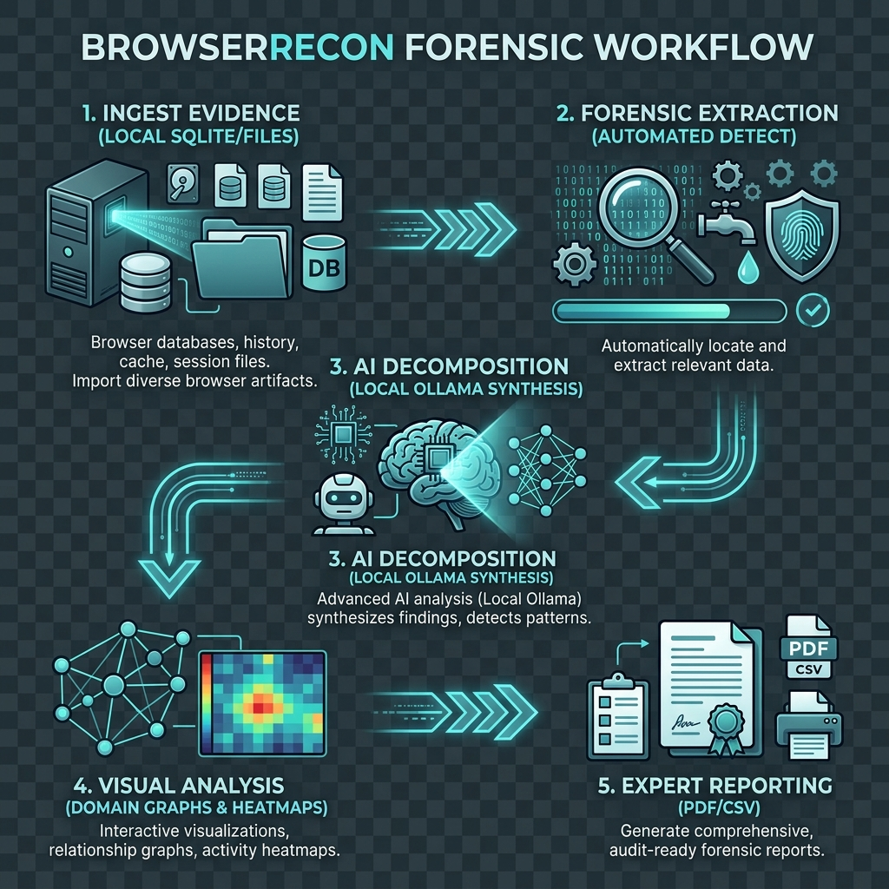

### 2. Cognitive Case Narratives (Local AI Synthesis)
**Function:** Transforming raw data into human-readable intelligence.
By hooking into a localized Ollama instance, BrowserRecon doesn't just display URLs—it synthesizes them. It analyzes search queries, groups related browsing activities, and generates a cohesive "Case Narrative" that explains the *intent* behind the user's sessions.

*`[Insert Screenshot: AI Case Narrative UI side-by-side with raw URL timeline]`*

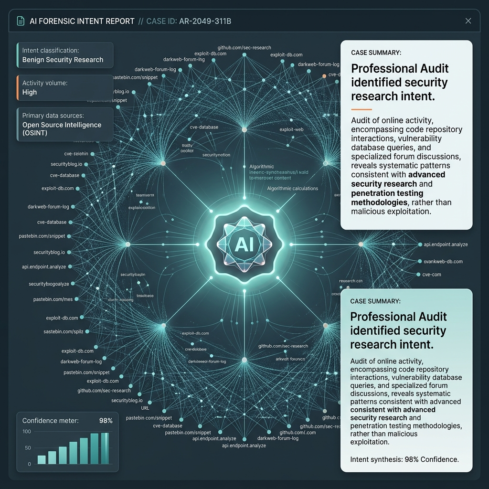

### 3. Behavioral Heatmaps & Analytics
**Function:** Visualizing activity patterns over time.
Identify when a user is most active using the Hourly Heatmap functionality. This creates a visual fingerprint of a user's normal routine, making anomalies (like a 3:00 AM login burst indicating a compromised account) glaringly obvious.

*`[Insert Screenshot: Visual Insights dashboard focusing on the Hourly Heatmap]`*

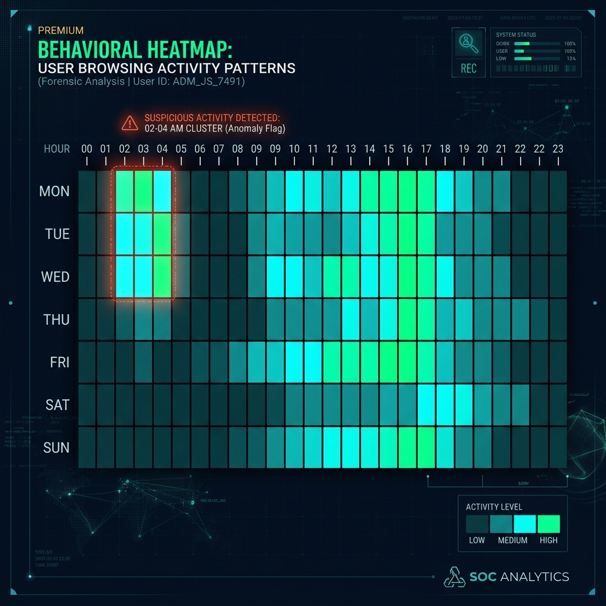

### 4. Domain Relationship Treemaps & Category Breakdown
**Function:** Mapping the center of gravity for digital habits.
The Treemap visualizer renders an interactive, nested box map of all visited domains. This allows analysts to instantly see the primary "hubs" of communication and commerce (like Google, Amazon, or Outlook) versus peripheral tracking or ad sites. A companion **Domain Category Breakdown** bar chart shows visit distribution across categories — Social, News, Finance, Malware, and more — with a legend sidebar for rapid category-level profiling.

*`[Insert Screenshot: Visual Insights dashboard highlighting the Domain Treemap and Category Breakdown visualizations]`*

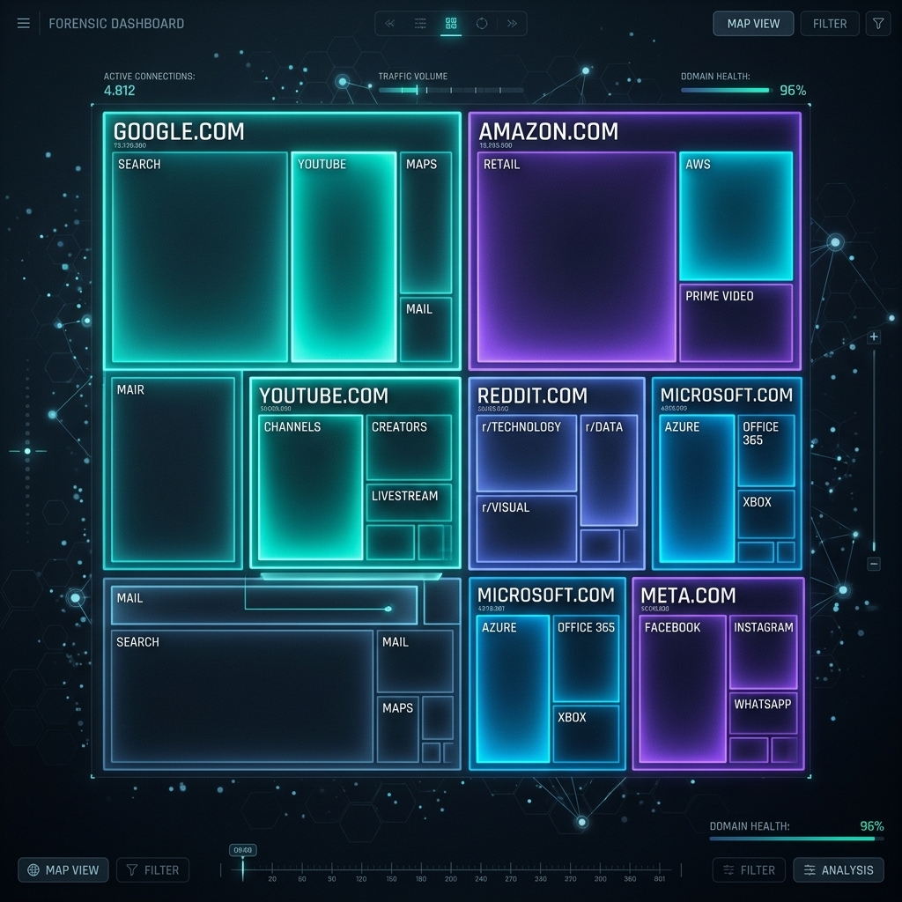

### 5. Automated Threat Intelligence (Intelligence Center)
**Function:** Flagging potentially malicious infrastructure natively.
The Intelligence Center cross-references ingested history against multiple threat vectors entirely offline. For the highest-risk domains identified by local analysis, optional live enrichment checks against **URLhaus** and **PhishTank** confirm active malware hosting or phishing in real time. Domain age via **RDAP** highlights newly registered domains — a hallmark of transient phishing infrastructure. If a user interacted with a known phishing domain or malware dropper, it is surfaced and ranked for the investigator.

*`[Insert Screenshot: Intelligence Center showing threat scores and flagged/malicious URLs]`*

### 6. Timeline Reconstruction & Drill-Down Search
**Function:** Granular, chronological investigation.
Reconstruct the precise, second-by-second journey of the user. Sort by date, filter by keyword, or isolate specific search engine queries to find exactly what the subject was looking for before an incident occurred.

*`[Insert Screenshot: Timeline interface showing advanced filtering and chronological flow]`*

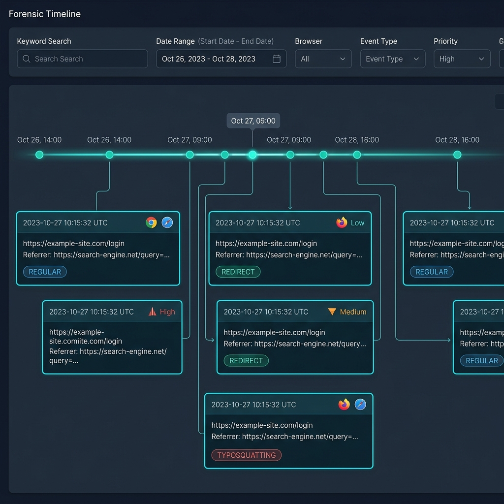

### 7. Session Reconstruction (Unified Timeline grouping mode)
**Function:** Grouping browsing activity into meaningful sessions.
BrowserRecon automatically clusters browsing records into distinct sessions using a 30-minute inactivity gap threshold. Each session shows its dominant domain, time span, duration, event count, unique domain count, and a duration z-score so outlier sessions are easy to spot.

As of the May 2026 refresh, session reconstruction is no longer a separate page — it is the **Session** grouping mode inside the **Unified Timeline**. Switch the Group selector to "Session" and the table reorganises into collapsible session blocks, each expandable to its member events. The deprecated `/sessions` route now redirects to `/unified?group=session` so existing bookmarks keep working.

*`[Insert Screenshot: Unified Timeline with Group=Session active, showing collapsible session blocks each with dominant domain, duration, event count, and z-score badge]`*

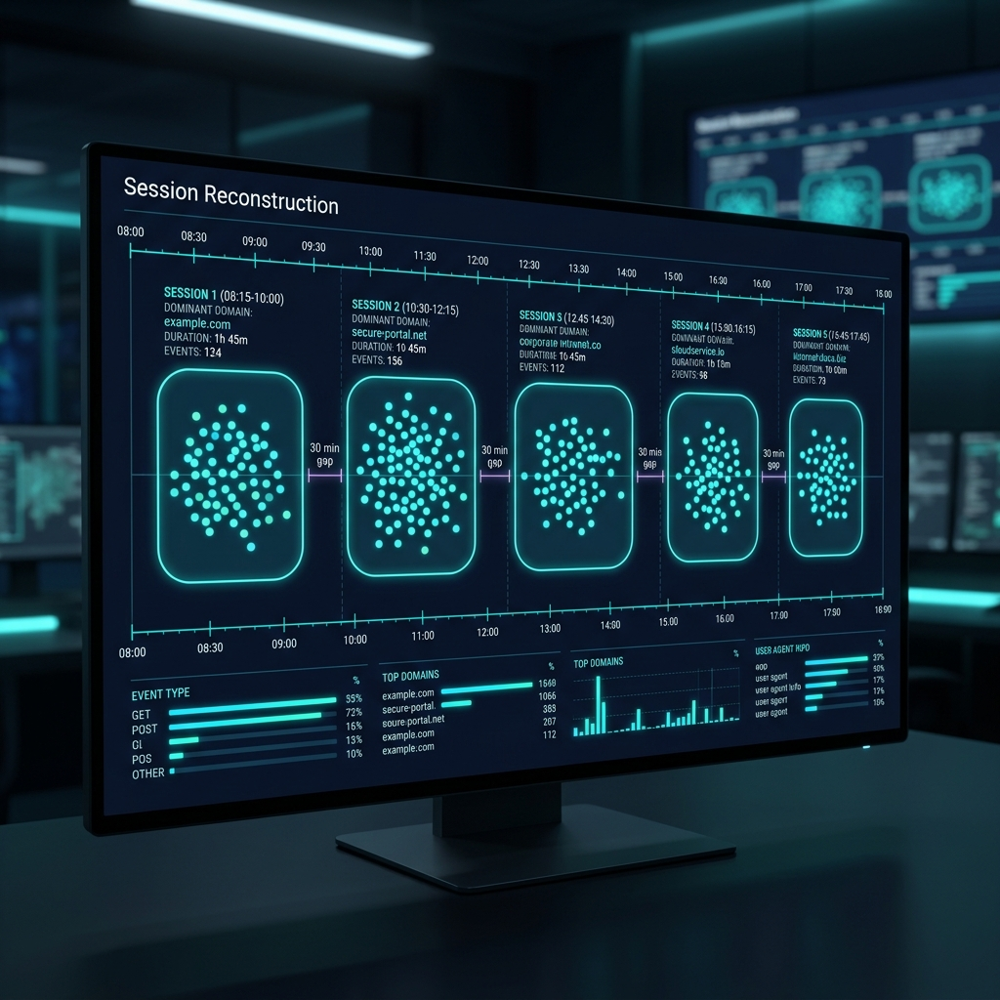

### 8. Investigation Bundle Export/Import
**Function:** Preserving complete forensic cases.
Export the entire current investigation — history, cookies, bookmarks, downloads, extensions, search queries, domain intelligence, and AI-generated report — into a portable `.brif` (Browser Recon Investigation File) bundle. Re-import the bundle on any BrowserRecon instance to restore full analysis context, making it easy to hand off cases between analysts.

*`[Insert Screenshot: Export page showing .brif bundle creation with all artifact types checked, and the import flow restoring a case]`*

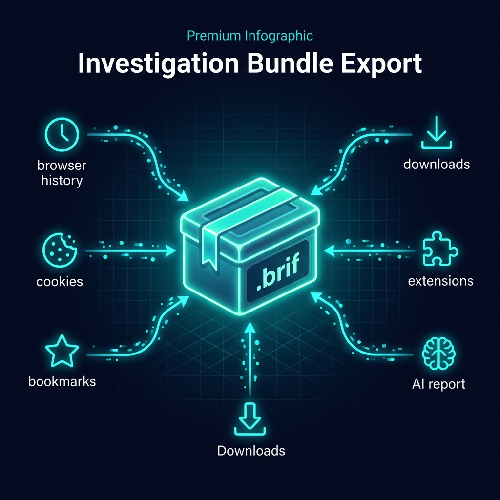

### 9. Advanced OSI Analysis Suite
**Function:** Local-first open-source intelligence enrichment.
BrowserRecon includes a comprehensive suite of OSI analysis tools organized into eight tabs in the Intelligence Center (Threat Summary, **Phishing**, Domains, DGA Entropy, Typo-Squat, Ext. Risk, Exfiltration, Credentials):

*   **Threat Summary**: Aggregates composite risk scores across all OSI signals (DGA, Typo-Squat, RDAP age, domain category, extension risk) into a single ranked view. Each domain receives an overall risk level (Critical/High/Medium/Low) and a 0–100 composite score for rapid triage.

*`[Insert Screenshot: Intelligence Center → Threat Summary tab showing composite risk scores, signal columns, and Critical/High risk badges]`*

*   **Domains** *(merged Domain Intel + Domain Age)*: Per-domain visit aggregation showing visit count, category, RDAP registration status, domain age, and last-seen date all in one table. Supports bulk RDAP enrichment with "ENRICH CATEGORIES", "ENRICH TOP 100", "ENRICH SELECTED (N)", and "RETRY FAILED (N)" buttons. Expandable rows show first seen, browsers, unique URLs, and RDAP registration date. Status badges (Known/New/Established/Error/Pending) and a **Known-Domains Whitelist** let analysts permanently mark trusted infrastructure — removing it from risk scoring and reducing noise across all eight Intelligence Center tabs.

*`[Insert Screenshot: Intelligence Center → Domains tab showing merged visit count, category badge, RDAP status/age, last seen columns, and expandable detail row]`*

*   **Phishing (Brand Impersonation)**: Flags pages whose `<title>` references a well-known brand (Microsoft/Outlook, Google/Gmail, Apple/iCloud, PayPal, Okta, GitHub, DocuSign, major banks, couriers, Adobe, Zoom, Slack, Coinbase, IRS, USPS, …) while the host is **not** on that brand's legitimate-domain allowlist. Catches lookalike infrastructure like `online.projects100-docus.top` that impersonates Microsoft login screens. Flagged events cascade into the Unified Timeline and History views as a `brand_impersonation` risk chip. Backed by the `get_brand_impersonation_hits` Tauri command.
*   **DGA Entropy Scorer**: Detects algorithmically generated domain names using Shannon entropy + n-gram bigram analysis with CDN/cloud whitelisting and tiered thresholds.
*   **Typo-Squat Detector**: Identifies potential phishing domains using Damerau-Levenshtein distance with homoglyph normalization against 36 brand targets with TLD variants.
*   **Extension Risk Scorer**: Scores browser extensions by declared permissions against a weighted risk rubric, and cross-references against known malicious extension databases. The parser resolves Chrome i18n placeholders (e.g. `__MSG_extName__`) against the bundled `_locales/<default_locale>/messages.json` so extensions render with their real names (uBlock Origin, Bitwarden, …) instead of cryptic placeholders. It also unpacks Firefox `.xpi` archives, extracts manifest icons, marks Chromium "component" (built-in) extensions, and gathers extensions from Chrome / Edge / Brave / Vivaldi / Yandex / Firefox. Each row in the Extensions tab now shows the real icon, a "built-in" pill for component extensions, hoverable plain-English permission tooltips, and a one-click link to the relevant Chrome Web Store or addons.mozilla.org page.

**Dynamic Threat Intel Enrichment**: The `run_threat_intel` command checks the top 10 medium-or-higher risk entries against URLhaus and PhishTank in real time, surfacing live threat hits directly in the Threat Summary tab.

**Column Sorting**: Every table across the Intelligence Center (all 8 tabs), ArtifactExplorer (History, Cookies, Bookmarks, Downloads, Extensions, Searches), and Timeline supports click-to-sort on all columns via the `useSortableTable` hook.

**Column Auto-Fit**: Tables using `ResizableTh` expose a **Fit** button (and double-click-to-fit on any column handle) that measures the longest rendered cell per column and snaps widths to content — powered by `src/lib/fitColumns.ts`.

**Right-Side Detail Drawer**: Clicking a Unified Timeline row opens a context-preserving side drawer (`DetailDrawer`) with the full URL, referrer, risk-flag chips, and one-click copy — replacing the old modal so the underlying list stays visible during triage. The drawer also exposes an **"Open in Artifact Explorer"** footer link that pivots the analyst from the timeline event back to its underlying artifact row.

**Configurable Rules Engine (May 2026)**: The Phishing, Exfiltration, and Credentials tabs are driven by a user-editable rules engine. Each tab has a gear-icon in the toolbar that opens a slide-in **RulesPanel** listing every rule with an enable/disable toggle, a 0–100 severity slider, and a JSON params editor. 13 builtin rules ship by default — including **Cyrillic / Unicode homoglyph detection**, IDN Punycode decode, brand-keyword + suspicious-TLD pairings, suspicious upload hosts, paste-site visits, large-download bursts, OAuth high-risk scopes, incognito-gap inference, and password-reuse detection. Analysts can also **author custom rules** using three flexible matcher categories:

- **`regex`** — match a Rust regex against any of these fields: `host`, `url`, `title`, `referrer`, `domain`, `path`. Case-sensitive or insensitive.
- **`contains`** — simple substring search on a chosen field.
- **`host_in_list`** — exact (or suffix) match against a custom host list.

Example rule (ships disabled by default as a regex template): a Cyrillic-block regex `[Ѐ-ӿ]` against the `host` field. The DGA Entropy, Typo-Squat, and Ext. Risk tabs instead expose a **SettingsPanel** for tuning numeric thresholds (entropy, distance, etc.) and editing the brand-target / CDN-whitelist / malicious-ID lists directly. All rules and settings persist as JSON in `%LOCALAPPDATA%\BrowserRecon\` (Windows) so customisations survive restarts and upgrades.

### 10. Theme — Light / Dark / System
**Function:** OS-aware theming.
The theme toggle is now tri-state — **Light**, **Dark**, or **System**. In *System* mode the app subscribes to `prefers-color-scheme` and flips live when the OS theme changes. Choice persists to `localStorage` under `browserrecon_theme`.

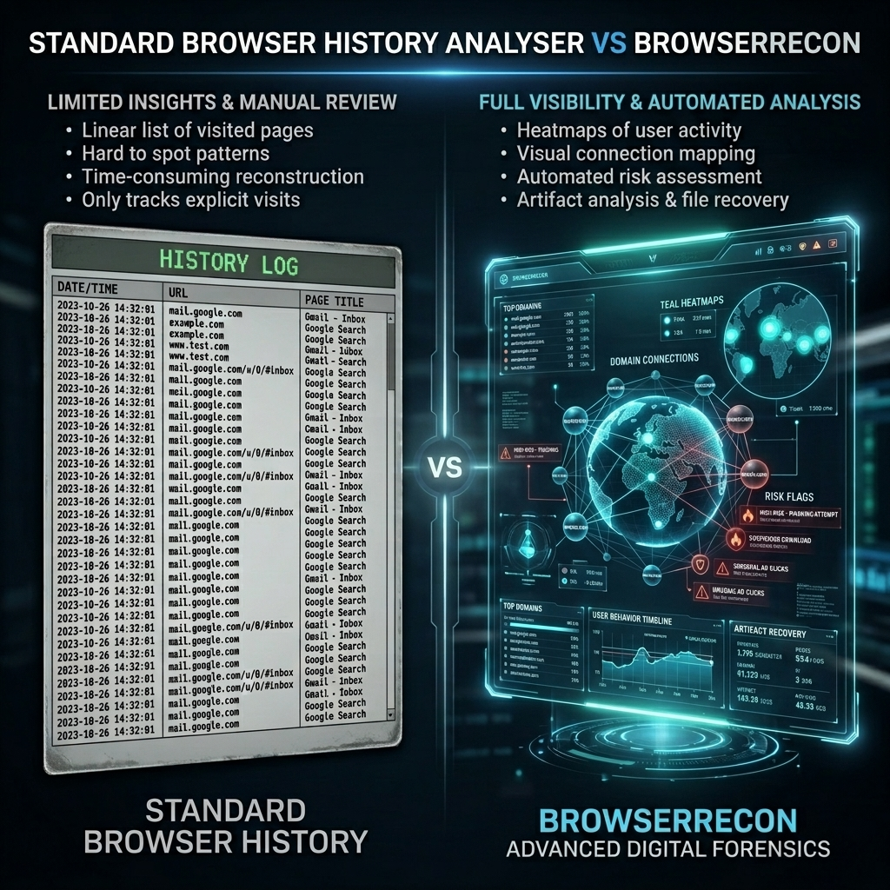

---

## 🏆 What Sets Us Apart?

Most history visualization tools are either browser extensions that want permission to "read all your data" or online services where you upload private files to someone else’s cloud. BrowserRecon is the differentiator between enterprise suites (expensive, complex) and consumer tools (invasive, limited).

*   **⚡ Context Over Content**: We don't just give you a list of URLs. We provide the *why*—connecting disjointed searches into behavioral intent via AI Synthesis.
*   **🔋 Frictionless Forensics**: No 500-page manuals. No week-long certifications. BrowserRecon is triage-ready infrastructure that runs on a USB drive, instantly turning any machine into an investigative workstation.
*   **💎 Aesthetic Precision**: We believe that good design is an investigative tool. Our modern, high-fidelity UI makes patterns of interest and threat flags "pop" visually, aiding rapid discovery where traditional gray-table forensic apps fail.

---

## 🚀 Getting Started (The ZIP Package)

BrowserRecon is distributed as a **Portable Forensic Package**. No installation is required, making it perfect for rapid triage on a USB drive.

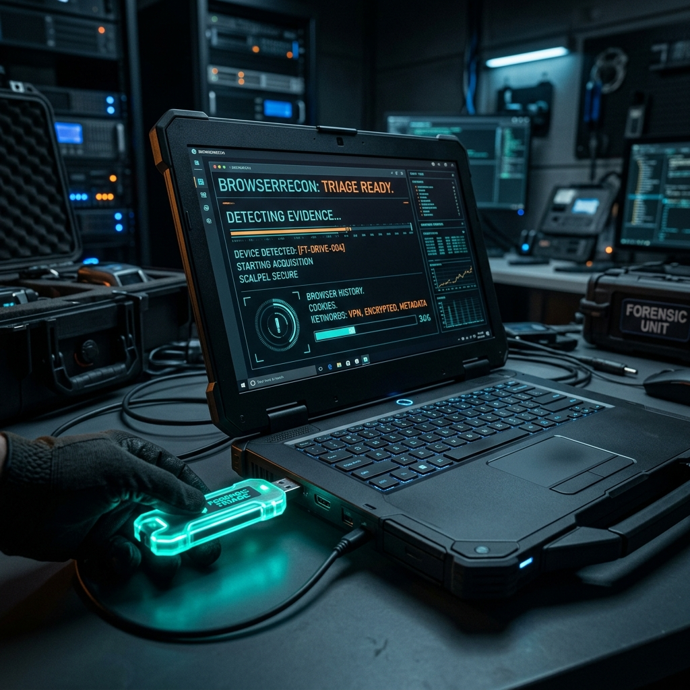

### 1. Ingestion
1. Download the latest dated release zip (e.g. **BrowserRecon_2026-04-21.zip**) — the archive mirrors the original `BrowserRecon.zip` manifest exactly (same 8 files, no extras).
2. Extract the archive and locate `BrowserRecon.exe`.
3. Use the **Auto Detect** feature to instantly find and shadow-copy history from supported browsers.

### 2. Establishing Trust
Because BrowserRecon is an internal-grade DFIR tool, Windows SmartScreen may occasionally flag it. To ensure a smooth experience:
*   Right-click `Run_Setup.cmd` and **Run as Administrator**.
*   This script will automatically establish local trust for the executable, allowing it to bypass SmartScreen and run with high integrity.
*   `Setup_Trust.ps1` also **Authenticode-signs** the bundled `scripts\windows_recon.ps1` collection script using the same local certificate, so it runs without PowerShell execution-policy warnings on analyst machines.
*   SHA256 checksums for the shell scripts (`macos_recon.sh`, `linux_recon.sh`) are generated in `scripts\checksums.sha256` for integrity verification on macOS/Linux.

### 3. Collection Scripts (Pre-Bundled)
The `scripts\` subfolder inside the ZIP contains ready-to-use artifact collection scripts for all platforms:

| Script | Platform | How to Run |
|--------|----------|------------|
| `scripts\windows_recon.ps1` | Windows | Right-click → Run with PowerShell (as Admin) |
| `scripts\macos_recon.sh` | macOS | `chmod +x macos_recon.sh && sudo ./macos_recon.sh` |
| `scripts\linux_recon.sh` | Linux | `chmod +x linux_recon.sh && sudo ./linux_recon.sh` |

Each script saves a ZIP archive to the same folder it runs from. Drag that ZIP into BrowserRecon's Evidence Ingestion screen. Scripts are also downloadable from within the app (Evidence Ingestion → Download Script).

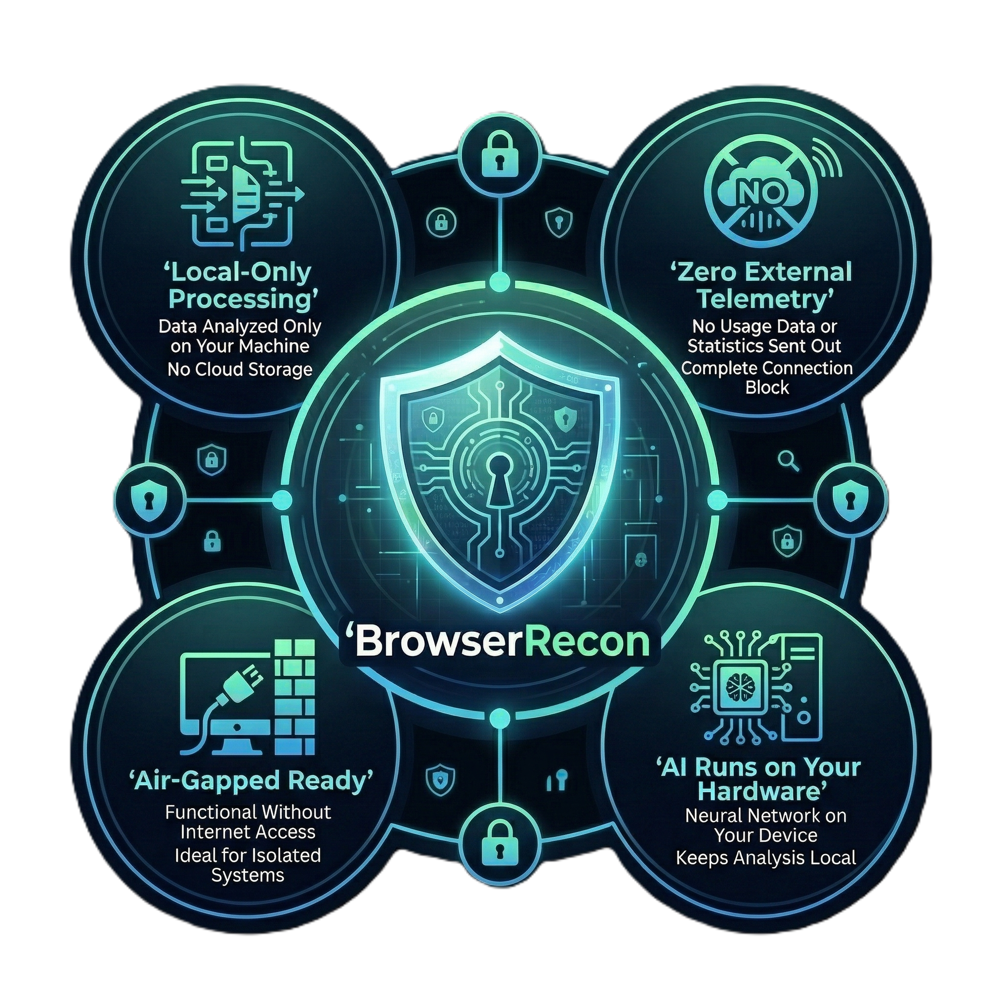

---

## 🌅 What's Coming Next

BrowserRecon is a living project, evolving alongside the modern web. Features on the active development roadmap:

*   **Heuristic Pattern Matching**: Automated detection of "Account Hijacking" and "Credential Stuffing" behavioral patterns across browsing sessions.
*   **Mobile Artifact Support**: Dedicated ingestion pathways for mobile browser history derived from smartphone forensic backups.

---

## 📜 The Final Word

BrowserRecon isn't just a tool; it's a statement about data sovereignty. It proves that you can have world-class forensic insights without sacrificing a single byte of privacy. It turns the "black box" of your browser into an open, visual, and intelligent archive.

**Own your history. Understand your habits. Secure your digital life.**

---

### [Download BrowserRecon.zip →](BrowserRecon.zip)

*Built by [Mathan Subbiah](https://github.com/PrototypePrime) for the DFIR community and privacy-conscious users worldwide.*
